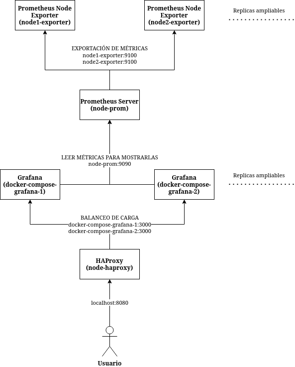
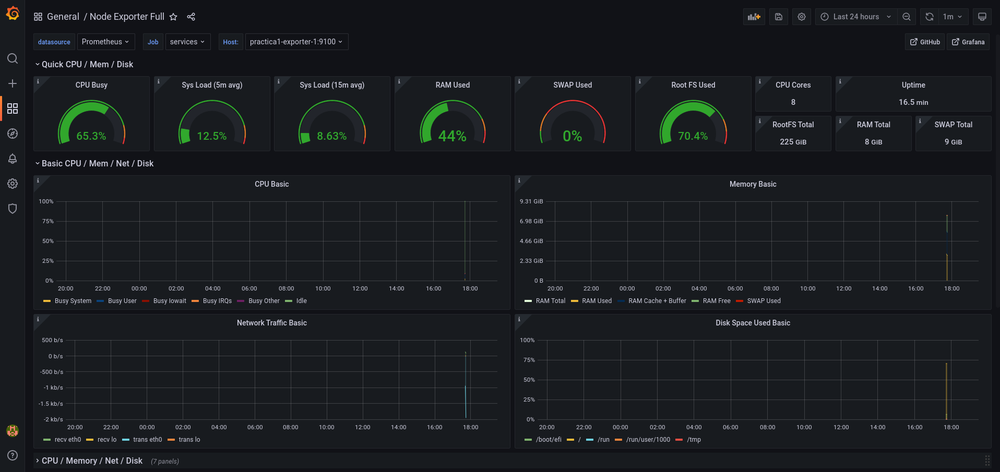

# Práctica 1

Realizada por Jose Luis Gallego Peña (Grupo de prácticas 1) [:octocat:](https://github.com/jlgallego99)

## Descripción de la práctica y problema a resolver
El diseño de servicios interconectados y desplegados en la nube es algo esencial en el paradigma Cloud Computing. Es por eso que esta práctica consiste en el despliegue de una serie de contenedores Docker que permitan a su vez desplegar unos servicios con los que monitorizar un sistema. El objetivo es conseguir un ecosistema de servicios que atienda a las demandas del Cloud: que sea escalable, tolerante a fallos, flexible y con una alta disponibilidad, de forma que pueda funcionar correctamente o arreglarse fácilmente siempre incluso si hay algún fallo en alguna de las partes.

Se ha resuelto este problema de composición y despliegue de contenedores de dos maneras: una primera manera usando solo contenedores docker con un script sin orquestador o herramienta de composición de servicios y una segunda usando una herramienta de este tipo como es docker-compose. En ambos casos se provee de un único fichero de configuración con todo lo necesario para desplegar todos los contenedores y ponerlos en funcionamiento rápidamente.

Estos servicios deben permitir la captura de métricas así como la exportación, publicación y visualización de estas en un nodo a monitorizar. Todo ello con alta disponibilidad en el servicio que nos permite visualizarlas. En el próximo apartado se profundizará en cuales son estos servicios, cómo funcionan, cómo están configurados y la manera de ejecutarlos.

## Servicios desplegados y su configuración
Se han configurado para desplegar 4 servicios (Prometheus Server, Prometheus Node Exporter, Grafana y HAProxy), en un total de 6 contenedores con las siguientes características:
- **Un contenedor de Prometheus Server y dos contenedores de Prometheus Node Exporter replicables**, con los cuales poder monitorizar el sistema y publicar las métricas en una URL que luego puedan leer otros servicios. Los contenedores de Node Exporter se pueden aumentar cuantos se quieran, con el objetivo de que Prometheus Server pueda coger las métricas de cualquiera de ellos. Estos se configuran como targets en Prometheus.
- **Dos contenedores de Grafana replicables**, con los cuales poder visualizar las métricas de Prometheus en un dashboard ya configurado. Al igual que con Node Exporter, Grafana está replicado para que pueda visualizar las métricas en cualquiera de ellos. Grafana se comunica con Prometheus para obtener las métricas que visualizar.
- **Un contenedor de HAProxy**, con el cual poder proporcionar alta disponibilidad y balancear la carga entre todos los contenedores de Grafana que se creen. De esta manera se puede acceder a una única dirección, que redirigirá a cualquiera de los nodos de Grafana disponibles. De esta manera si cualquiera de los nodos de Grafana se caen, tendremos otro listo para funcionar de forma transparente al usuario.

Los contenedores y servicios que se tienen, así como sus conexiones, están resumidas en el siguiente diagrama que indica además con qué hostname y puerto acceden entre sí. La flecha indica la dirección en la que se conectan los contenedores. Todos los contenedores quedan desplegados en una red común en la que pueden referirse entre ellos mediante su nombre en lugar de con una dirección IP.



Para la configuración de cada uno de los servicios se han creado los archivos de configuración correspondientes, que se pueden encontrar en el árbol de directorios:
- **prometheus/**: Contiene los dos ficheros de configuración yml básicos que necesita Prometheus. El primero, [alert.yml](./prometheus/alert.yml), indica las alertas que notificará Prometheus. En concreto se define un grupo de alertas con una sola alerta, que notifica si Prometheus se ha caído durante más de 5 minutos. El segundo fichero llamado [prometheus.yml](./prometheus/prometheus.yml) es el más importante y define la configuración de la aplicación. En él se indican varias cosas: de forma global se indica la periodicidad con la que se capturen métricas (configurado a 15 segundos), se indica cual es el fichero de reglas anteriormente definido y por último se le indica de donde coger las métricas. Para coger las métricas se indica la URL (usando el nombre del contenedor) de cada una de las réplicas que tenemos de node-exporter, que es el servicio encargado de publicar las métricas. Es por esto que indicamos en un array varias URLs con tanto la propia de prometheus como la de todos los exporters en el peurto 9100 por defecto, indicándolos como targets de donde sacar las métricas. Si uno de los exporters se cae, tenemos el otro para seguir recibiendo métricas y no habría ningún problema.
- **grafana/provisioning/**: Contiene todo lo que se le da a grafana de forma estática al crear el contenedor, concretamente el dashboard que queremos tener instalado por defecto y la configuración de donde leer las métricas para poder mostrarlas en este dashboard. El provisioning es una opción que nos da Grafana para poder configurarlo todo mediante ficheros que puedan ser gestionados por un control de versiones como Git, pudiendo así iniciar Grafana con todo lo necesario automáticamente.
    - **dashboards/**: Contiene un fichero yml [dashboard.yml](./grafana/provisioning/dashboards/dashboard.yml) acorde a la especificación de la documentación de Grafana, mediante el cual se indica la ruta del dashboard que queremos que se instale en la aplicación y se le da un nombre. Este dashboard está en formato Json y está almacenado en este directorio, para obtenerlo basta con buscar en la web de Grafana y descargar el que queramos.
    - **datasources/**: Contiene un fichero yml ([datasource.yml](./grafana/provisioning/datasources/datasource.yml)) acorde a la especificación de la documentación de Grafana, mediante el cual se indica la dirección http en la cual grafana cogerá los datos de las métricas. En nuestro caso esa dirección es *http://node-prom:9090*, es decir, nuestro servicio de Prometheus accediendo a través de su nombre definido en el contenedor. El resto de opciones se han dejado por defecto, indicando en general que esta fuente de datos la hemos llamado Prometheus y que accedemos de forma normal mediante una url.
- **haproxy/**: Contiene un único fichero de configuración [haproxy.cfg](./haproxy/haproxy.cfg) en el cual se indica todo lo necesario para que el servicio de HAProxy pueda balancear la carga y proporcionar alta disponibilidad a las réplicas de Grafana. En el primer bloque *defaults* se indica el tiempo que haproxy esperará hasta poder realizar una conexión o una petición correctamente a alguno de los frontends y backends. En el siguiente bloque se define el frontend, en el cual se define la dirección y puertos a las que se conectará el usuario para acceder a cualquiera de los backends de Grafana, en concreto se selecciona el puerto 80 interno y se indica a qué backend hace referencia. El último bloque es definir precisamente este backend, indicando primero el algoritmo de balanceo de carga (en este caso, round robin) y luego indicando la dirección de cada uno de los backends. Estos backends son réplicas de Grafana, y nos referimos a ellas usando su nombre de contenedor y el puerto por defecto de Grafana que es el 3000. Con esto HAProxy ya puede balancear la carga entre las réplicas de Grafana, y al aumentar el número de réplicas bastaría con añadir nuevas líneas con las nuevas réplicas para que las tenga en cuenta.

Además, los servicios de Prometheus y Node Exporter se ejecutan con una serie de opciones por defecto. El cómo se indican depende del método para desplegar los contenedores, por lo que se explicará en la siguiente sección. Estas opciones son varias de las que se suelen poner por defecto, e indican lo siguiente:
- **Prometheus**:
    - **--web.enable-lifecycle** permite iniciar y parar el servicio mediante peticiones HTTP.
    - **--config.file=/etc/prometheus/prometheus.yml** indica el directorio donde se encuentra el archivo de configuración que se ha explicado y definido antes.
    - **--storage.tsdb.path=/prometheus** indica el directorio donde se almacenarán las métricas. Esto será un volumen que crearemos con docker, para dotar de persistencia entre host y contenedor a los datos.
    - **--web.console.libraries=/etc/prometheus/console_libraries** indica dónde se encuentran las bibliotecas de la consola de Prometheus.
    - **--web.console.templates=/etc/prometheus/consoles** indica dónde se encuentran las plantillas de la consola de Prometheus.
    - **--storage.tsdb.retention.time=7d"** es la opción pedida para la práctica, con la que se indica cuánto tiempo mantener las métricas en almacenamiento, a partir de lo cual se eliminarán. Se ha configurado para una semana (7 días).
- **Node Exporter**: Se indican los argumentos **--path.procfs=/host/proc --path.rootfs=/rootfs --path.sysfs=/host/sys** que son los que vienen por defecto para indicar dónde se encuentran las configuraciones de node exporter.

Una vez ejecutados los contenedores de cualquiera de las dos formas, podemos acceder a la dirección http://localhost:8080 para acceder a Grafana. Nos recibirá una pantalla de login, en la que debemos escribir de usuario y contraseña "admin", y así llegaremos a la página principal. Para acceder al dashboard, que está ya instalado automáticamente y con la fuente de datos también incluida automáticamente, basta con acceder al menú lateral de Dashboards y luego a Browse, donde encontraremos el dashboard que se ha instalado, y al hacerle click ya podemos ver las métricas tal y como se muestra en la siguiente imagen:



A continuación se muestran las dos formas que se han desarrollado para desplegar el ecosistema explicado.

### Desplegar servicios con docker sin compose
Como primera forma tenemos el despliegue de todos los contenedores sin un orquestador o compositor de servicios como Kubernetes o docker-compose, si no usando múltiples instrucciones docker y configurándolo todo de esta manera mediante un único script del shell. Este script del shell llamado [contenedores_docker.sh](./contenedores_docker.sh) se puede ejecutar de la siguiente manera (es necesario tener instalado docker y bash o zsh para ejecutar el script del shell):  

```./contenedores_docker.sh run run```

Esto iniciará todos los contenedores en segundo plano, listos para funcionar. Accediendo a la dirección http://localhost:8080 tenemos el punto de entrada del sistema, el servicio de HAProxy que nos sirve cualquiera de las instancias de Grafana, pudiendo acceder sin problemas al servicio y monitorizar usando el dashboard.  
Para parar la ejecución de los contenedores, volver a ejecutar el script del shell con la opción correspondiente:

```./contenedores_docker.sh run stop```  

En el caso de que no se le indique ningún argumento al script, este no hará nada.

Al inicio del script se indican los argumentos que aceptan tanto Prometheus como Node Exporter al iniciar sus contenedores y que fueron explicados en la sección anterior, definidos como variables para usar luego.

Luego se comprueba el argumento que se le pasa al script. Si este argumento es *stop*, se llama a la utilidad de terminal de docker para primero parar cada contenedor según su nombre y luego eliminarlo para que no quede nada en funcionamiento. Por otro lado si el argumento es *run*, se llama a la utilidad de terminal de docker para primero crear los volúmenes necesarios para que Prometheus y Grafana persistan sus datos de métricas entre el host y el contenedor, luego se crea manualmente una red que compartirán todos los contenedores para que puedan comunicarse entre sí por su nombre y sin problemas, y por último se crean y ejecutan todos los contenedores definidos.

Todos los contenedores que se ponen en funcionamiento usan imagenes de DockerHub ya prefabricadas, por lo que no es necesario crear ningún archivo Dockerfile.

Estos contenedores se ejecutan con las siguientes opciones: *-it* para que el contenedor sea interactivo y con terminal, *-d* para ejecutarlo en segundo plano, *--name* para darle un nombre con el que se referirán ellos entre sí, *-v* para indicar los volumenes que se montarán, *-p* para hacer una redirección entre puerto del contenedor y puerto del host, *--expose* para exponer un puerto del contenedor sólamente a los contenedores de esa red y por último *--network* para indicar la red que estará unida el contenedor, que es la anteriormente creada. 

Concretamente, la opción de redirigir puertos solo se usa para aquellos contenedores a los que nos interesa acceder desde nuestra máquina, es decir, los contenedores de HAProxy (para poder acceder a Grafana, y no directamente al contenedor de Grafana) y al de Prometheus para comprobar que todos los targets están bien. Los contenedores de Node Exporter y Grafana, al estar replicados, basta con usar la opción de expose ya que no vamos a acceder directamente a ellos si no que accederán los otros contenedores internamente por su cuenta. Además, al estar replicados, no podríamos redirigir al mismo puerto puesto que dos servicios no pueden tener el mismo puerto.

Por último cabe destacar que al iniciar estos contenedores se indica la opción de montar volúmenes para distintas cosas. Ya sea para montar un volumen con persistencia de datos (en el caso de Prometheus y Grafana), o ya sea para montar los archivos de configuración del host en el contenedor (haciendo así una redirección de estos directorios entre host y contenedor). De esta manera los contenedores tienen los archivos de configuración que necesitan y exactamente donde los necesitan dentro del contenedor para poder funcionar correctamente. La estructura de directorios creada con un directorio para cada servicio simplifica esto.

### Desplegar servicios con docker-compose
Como segunda forma de despliegue, siendo más sencilla, directa y común que la anterior, tenemos usando la herramienta docker-compose, que está pensado para realizar estas tareas de composición y despliegue de contenedores. Todo está configurado en un único fichero [docker-compose.yml](./docker-compose.yml), que al ejecutarlo con la siguiente instrucción pone en marcha todos los servicios en segundo plano (es necesario tener instalado docker y docker-compose):

```docker-compose up -d```

Pudiendo ahora acceder de igual manera a la dirección http://localhost:8080 donde tenemos el punto de entrada del sistema, el servicio de HAProxy que nos sirve cualquiera de las instancias de Grafana, pudiendo acceder sin problemas al servicio y monitorizar usando el dashboard.  
Para parar la ejecución de los contenedores, se ejecuta la siguiente orden:

```docker-compose down```

Al inicio de este fichero de descripción de servicios definimos los volumenes que vamos a usar, que de la forma anterior creábamos directamente con docker. Luego de esto ya podemos describir cada uno de los servicios, en total 4, usando las mismas opciones que usamos en la modalidad anterior, salvo por la diferencia de que docker-compose nos permite replicar los servicios de una forma más sencilla y automática.

Al igual que en el caso anterior todos los servicios usan imágenes de DockerHub, y a cada uno de los servicios se le indica un nombre, los volumenes que se montan y redirigen, los comandos y una opción *restart: always* que indica que siempre intente reiniciar el servicio si se ha caído. Los puertos tanto para redirigir (port) como para exponer (expose) funcionan de la misma manera que antes.

La ventaja que nos da docker-compose, además de poder definir los servicios de una forma mucho más fácil, es que nos crea la propia red de forma automática y además nos da una opción para replicar. En los servicios de Grafana y Node Exporter se añade la siguiente opción al servicio:

```
deploy:
    mode: replicated
    replicas: 2
```

Esto indica que se cree el mismo servicio con las mismas características definidas tantas veces como se indica en la función replicas, siendo en este caso dos pero puede ampliarse cuanto quiera. Esto creará varios contenedores con el siguiente tipo de nombre: practica1-NOMBRESERVICIO-NUMEROREPLICA, donde NOMBRESERVICIO es el nombre del servicio definido en el nivel directamente superior (grafana o exporter) y NUMEROREPLICA es el número de replica que se está creando. Esto nos da unos nombres de host con los que referirnos a cada una de las réplicas sin equivocarnos.

Como se ha explicado antes, al aumentar el número de réplicas, es necesario añadir sus nombres a los archivos de configuración de Prometheus (si se replica Node Exporter) y HAProxy (si se replica Grafana). Puesto que los nombres son predecibles, escalar los servicios es algo fácil y rápido de hacer con tan solo añadir una línea a cada fichero de configuración según el nuevo número de réplicas.

## Conclusiones
Tanto Docker como Docker-Compose son herramientas muy potentes y que nos permiten desplegar un gran número de servicios en muy poco tiempo, funcionando correctamente y permitiendo un ciclo de desarrollo más flexible y agilizado, pudiendo centrar los esfuerzos en otras cosas. En concreto Docker-Compose se ha visto como una utilidad mucho más adecuada para desplegar muchos servicios a la vez ya que está pensado para esto y da muchas facilidades como la replicación.

Se ha visto la importancia de los archivos de configuración en los servicios, que son fáciles y rápidos de configurar y muy potentes. Tener una buena estructura de directorios y configuraciones es esencial para desplegar un ecosistema en el Cloud. Este ecosistema además hemos hecho que sea tolerante a fallos, con alta disponibilidad y flexible, pudiendo aumentar el número de contenedores cuanto queramos, así como monitorizar su rendimiento. Se destaca la importancia de servicios como HAProxy para poder acceder a un mismo servicio con distintas réplicas de forma transparente al usuario, que creo que es esencial en un ecosistema en el que se busca tener múltiples nodos funcionando a la vez.

En conclusión tenemos un sistema robusto, flexible, escalable y disponible perfectamente adecuado para desplegarse en el Cloud y adaptándose a todas las exigencias de este paradigma. Se ha visto que para desarrollar en Cloud hay que tener en cuenta ciertos aspectos que antes no se tenían en cuenta pero que nos dan como resultados servicios más complejos pero fáciles de desplegar y con un buen funcionamiento.

## Referencias bibliográficas y recursos utilizados
- [Documentación de grafana para provisioning](https://grafana.com/docs/grafana/latest/administration/provisioning/)
- [Documentación de Docker para ejecutar contenedores](https://docs.docker.com/engine/reference/commandline/run/)
- [Documentación de Docker para crear redes](https://docs.docker.com/network/network-tutorial-standalone/)
- [Configurar HAProxy con Docker](https://www.haproxy.com/blog/how-to-run-haproxy-with-docker/)
- [Documentación de HAProxy para backend](https://www.haproxy.com/documentation/hapee/latest/configuration/config-sections/backend/)
- [Configurar réplicas de docker compose](https://www.deploycontainers.com/2021/09/23/configure-docker-container-replicas-with-docker-compose/)
- [Node Exporter Full Dashboard](https://grafana.com/grafana/dashboards/1860)