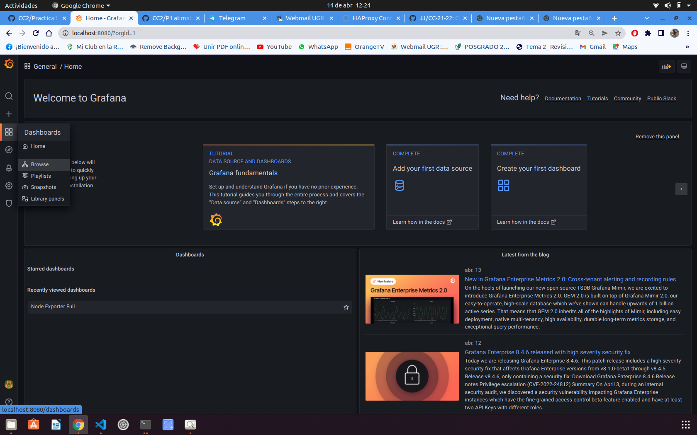
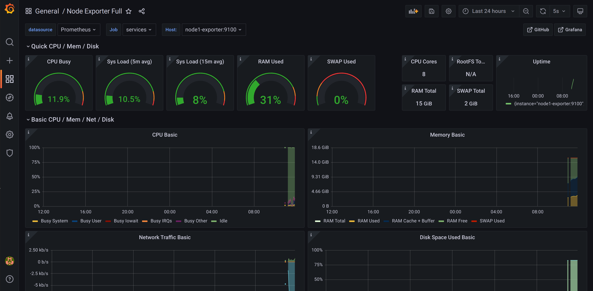
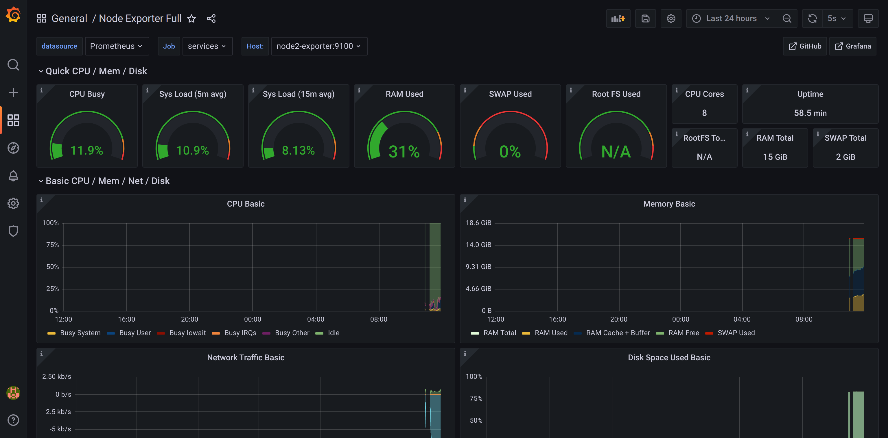
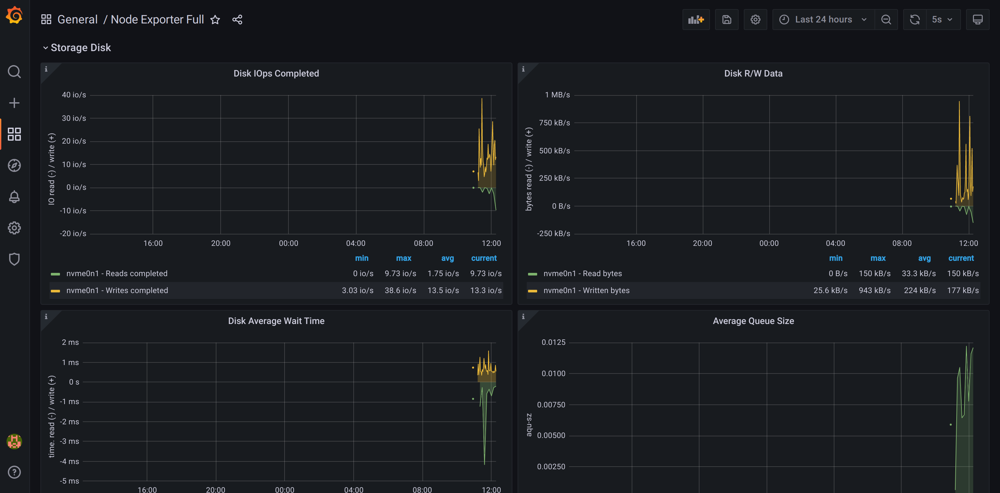
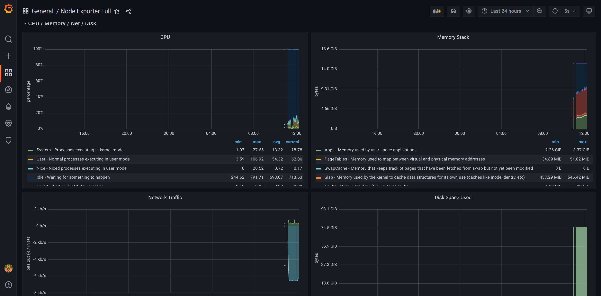
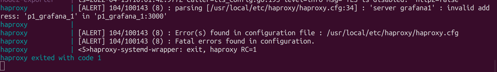

# Información sobre la práctica 1
## Nombre del alumno y grupo de prácticas
Juan Carlos González Quesada y Grupo 1 (19:00-20:30)

## Perfil de GitHub asociado
@jcgq
## Descripción de la práctica y problema a resolver
Para el desarrollo de la práctica teníamos que unir varios servicios que se interconectaran entre ellos, en donde utilizaremos:

- **Grafana**: nos permitirá la visualización, evoluciñon y formato de datos métricos.

- **Prometheus**: que lo utilizaremos para registrar las unidades métricas y permite la supervisión y alerta de eventos.

- **Node-Exporter**: es un nodo de Prometheus para métricas a nivel de servidor y de sistema operativo con colectores de métricas configurables. Será de donde obtangamos las métricas que vamos a visualizar.

¿Qué utilizaremos para la distribución de las cragas? Un balanceador de cargas:

- **HAProxy**: que proporciona un equilibrador de cargas de alta disponibilidad que distribuye solicitudes entre varios servidores.

La idea general del proyecto, es que un usuario acceda a la dirección HAProxy, que mostrará el servicio que analiza: Grafana. A su vez, este servicio obtiene los datos que genera Prometheus, que los obtiene de las métricas de Node-Exporter.

## Servicios desplegados y su configuración. (Incluye todos los detalles necesarios)
Algunas de las cosas que se describen a continuación, se han realizado en clase durante las sesiones prácticas. Hay configuraciones y sentencias que las ha comentado el profesor (entendiendo el porqué), para que los servicios se levante y usen sin problemas.

**Despliegue**
Para poder poner en marcha nuestro sistema, será necesario realizar la siguientes órdenes:
- **make up**: que levantará los servicios y abrirá la página en donde visualizar las métricas de grafana. Será necesario cargar el dashboard clicando en donde indica la imagen:

Luego, clicaremos en el único que nos aparece:

- **make up-d**: si queremos activar lo anterior pero en modo demonio.

- **make down**: para parar los servicios.

- **Grafana**: Será necesario crear su carpeta grafana, donde se alojará la carpeta provisioning y dentro de ella dos carpetas:
    - **Dashboard**: donde tendremos el panel que queremos automatizar para la visualización de las métricas (De esta forma evitaremos que se tenga que crear cada vez que se levanten los servicios) Aquí tenemos el panel en formato [json](https://github.com/jcgq/CC2/blob/main/P1/grafana/provisioning/dashboards/node-exporter-full_rev26.json), que se puede descargar desde [aqui](https://grafana.com/grafana/dashboards/) y [un archivo de configuración](https://github.com/jcgq/CC2/blob/main/P1/grafana/provisioning/dashboards/dashboard.yml), en donde se indicará la ruta de donde se obtiene el panel.
    - **Datasources**: será la carpeta donde se indique en un [archivo de configuracion](https://github.com/jcgq/CC2/blob/main/P1/grafana/provisioning/datasources/datasource.yml), de que ruta se obtienen los datos para la visualización. Este archivo lo podemos encontrar (Sin nuestras modificaciones para el proyecto), en la [web oficial de Grafana](https://grafana.com/docs/grafana/latest/administration/provisioning/#example-data-source-config-file)
    Hemos elegido el Node-Full, porque a parte de ser el mejor valorado y con más valoraciones positivas, es fácil de modificar y permite la visualización y análisis de un montón de parámetros y es el que se utilizó en clase.
    - **Servicio**: para el desarrollo de esta parte lo hemos intentado de varias maneras:
        - **Replicas**: en el nodo de grafana, se indica con *deploy*, metodo *replicated* y en el número de réplicas *2*, que nos haga dos réplicas. El inconveniente que hemos tenido, es que nosotros no controlamos el nombre que *HAProxy* le da a los contenedores que crea, por lo que luego, no los encontraba a la hora de poder mostrarlo en el *localhost:8080*. Sin embargo, se ha dejado reflejado en el [docker-compose](https://github.com/jcgq/CC2/blob/main/P1/docker-compose.yml) pero de forma comentada.
        - **Nodos**: se han creado dos nodos del tipo *Grafana* muy similar a los *node-exporter*, en donde exponemos el puerto, le damos un nombre diferente y, le indicamos la fuente de datos en el apartado de *volumes*

- **Node Exporter**: Simplemente será necesario crear dos nodos en el docker compose, exponiendo el puerto *9100*.

- **Prometheus**: Para este servicio, habrá que tener en cuenta dos partes:
    - **Configuración**:
        - [Alert](https://github.com/jcgq/CC2/blob/main/P1/prometheus/alert.yml): en este archivo se crearán reglas que lanzarán una excepción cuando ocurra algo (Lo que definamos, en concreto).
        - [Prometheus](https://github.com/jcgq/CC2/blob/main/P1/prometheus/prometheus.yml): es el archivo de configuración, en donde se indica el anterior archivo y de donde se van a sacar las métricas, en nuestro caso de los dos *nodos exporter*.
    - **Contenedor**: En el docker-compose, se le indican varios comandos de configuración (explicados en clase) y los volumenes, como en Grafana, de donde se van a lozalizar los datos.

- **HAProxy**: Será el puerto *localhost:8080*, desde donde visualizaremos Grafana.
    - **Contenedor**: se le indica de los dos nodos (en nuestro caso) de los que depende, que serán los dos creados de grafana. Y además, los volúmenes asociados al servicio.
    - **Configuración**: al [archivo](https://github.com/jcgq/CC2/blob/main/P1/haproxy/haproxy.cfg) que se creó en clase, y que se puede obtener en [HAPROXY](https://www.haproxy.com/blog/how-to-run-haproxy-with-docker/), se indica sobre que servicios se va a realizar el balanceo de cargas, que en nuestro caso, será: *grafana<1-2>:3000 check*

## Conclusiones
Gracias a esta práctica hemos podido trabajar y conocer de una forma más profunda la utilidad que no sofrecen los servicios como Docker y Docker-Compose, sobre todo para poder desplegar servicios en la nube de una forma rápida, consistente y escalable.

Se ha tenido una gran curva de aprendizaje debido a que nunca se había realizado una práctica similar y la configuración de los servicios presenta un elevado grado, a mi parecer, de precisión y de conocimientos mínimos. Hay que tener en cuenta los volumenes, los puertos, los archivos de configuración, los datos, los comandos internos...

No obstante, gracias a servicios como HAProxy hemos generado un blanceador de cargas que evitará la sobrecarga del sistema y, que si por algún motivo algono de los servicios de Grafana falle, siempre haya datos del operativo, lo que dotará a nuestro servicio de una alta disponibilidad.

## Referencias bibliográficas y recursos utilizados
Los enlaces que se han seguido para el desarrollo de la práctica son los siguienets:
- [Grafana](https://grafana.com/)
- [HAProxy Web](https://www.haproxy.com/blog/how-to-run-haproxy-with-docker/)
- [Grafana Datasource](https://grafana.com/docs/grafana/latest/datasources/prometheus/)
- [YouTube](https://www.youtube.com/watch?v=ECLIqvayAEs&ab_channel=Thetips4you)
- [GitHub CC](https://github.com/manuparra/cc2122)
- [HaP Configuracion](https://www.haproxy.com/blog/haproxy-configuration-basics-load-balance-your-servers/)
- Ayuda de compañeros (Con enlaces de documentación o errores que no estaban claros por internet):
    - [José Luis Gallego](https://github.com/jlgallego99)
    - [Jorge Prieto](https://github.com/soyjorgeprg)
    - [Diego Hernández](https://github.com/LCinder)
## Práctica y archivos
Todos los archivos referentes a la práctica, se pueden encontrar dentro de la carpeta *[P1](https://github.com/jcgq/CC2/tree/main/P1)*

## Material auxiliar (imágenes para la documentación, ficheros de configuración, etc.)
Todo está referenciado en la propia documentación, por lo que aquí se mostrará la información de los dos nodos-exporter:
- Node 1: En este nodo hemos añadido una nueva gráfica en forma de línea temporal.

- Node 2

**Otra información relevante**
Como la información de los discos o de la CPU
- Storage Disk:

- CPU/Memory/Net:

- **Error solucionado**
Cuando intentaba utilizar el método de *deploy: replicated* sólo me salía este error

Tras mucho investigar, descubrí un [foro](https://stackoverflow.com/questions/36724948/docker-compose-unsupported-config-option-for-services-service-web), en donde indica que podía ser un problema de permisos o autentificación de *Grafana*, por lo que añadí dos líneas al [datasource](https://github.com/jcgq/CC2/blob/main/P1/grafana/provisioning/datasources/datasource.yml), que fueron:

- basicAuth: true

- basicAuthUser: admin

Que anteriormente estaban vacías, y el error se solucionó. por tanto, quise hacer la prueba con tres grafanas y los servicios se levantaban y ejecutaban sin problema.