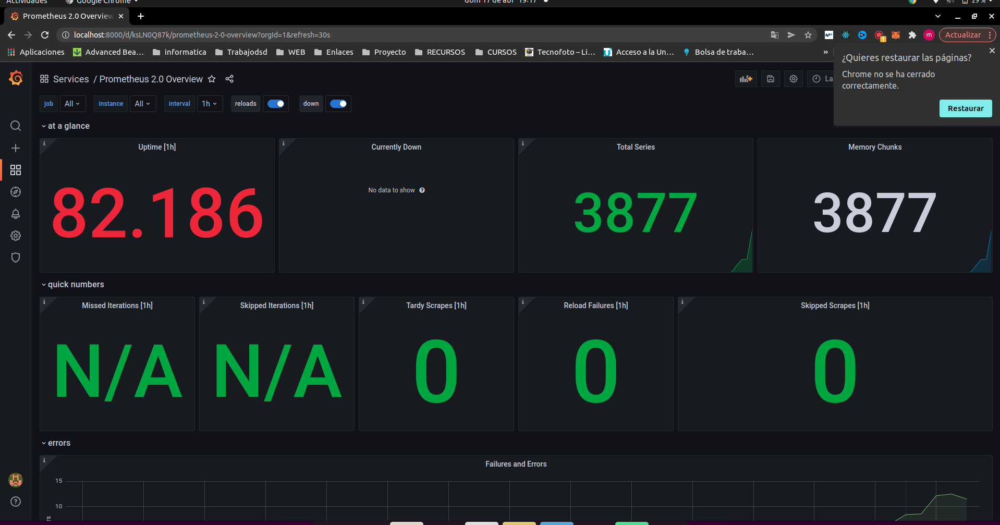

# Práctica 1

**Miguel García Tenorio**  
*Github: Migueg*

## Descripción

El objetivo principal de la  práctica consiste en el despliegue y la orquestación de contenedores de manera que se tenga un sistema de servicios escalable que se comuniquen entre sí.Con la realización de esta práctica se busca contar con una serie de contenedores cuyos datos sean persistentes y que den servicio al usuario a pesar de que alguno de ellos falle.  
Para conseguir tal objetivo se implementarán dos opciones:
+ Orquestación y despliegue de contenedores usando un script mediante ordenes de docker
+ Orquestación y despliegue de contenedores usando docker compose

## Servicios desplegados

Se tendrá el siguiente sistema de contenedores:

+ Capa Inferior:
  + **Node exporter**: En la capa inferior contaremos con **2** contenedores node exporter que se encargarán de recoger datos del sistema, los cuales serán usados por el contenedor de Prometheus

+ Capa intermedia:
  + **Prometheus server**: En la capa intermedia se tendrán un contendor de Prometheus

+ Capa superior:  
  + **Grafana**: Se desplegarán **2** contenedores de grafana
  + **HAProxy**: Encima de los contendores de grafana habrá un HAProxy que actuará como balanceador de carga entre los nodos de grafana


  ## Configuración

  ### Script

  Para desplegar el sistema de contenedores se cuenta con un script de bash que tomará los siguientes argumentos:

  + **clone**: Se encargará de clonar el repositorio y situarse en la carpeta desde donde se tendrá que ejecutar el Script
  + **container**: Se indicará este argumento cuando se quiera interactuar con el sistema de contenedores desplegado con ordenes docker. Este argumento deberá de ir acompañado de una de las siguientes opciones:
    + **start**: Creará las imágenes necesarias o las descargará del repositorio remoto y posteriormente levantará cada uno de los contenedores
    + **up**: Solo levanta los contenedores
    + **down**: Para los contenedores
    + **delete**: Para los contenedores, los borra y posteriormente borra las imágenes  


  + **compose**: Para docker-compose. Deberá ir acompañado de uno de los siguientes argumentos:
    + up: Equivalente a docker-compose up
    + down: Equivalente a docker-compose down


  Para el correcto funcionamiento del script habrá que ejecutarlo con la orden source, siendo un ejemplo el siguiente:

  ```
  source ./docker-option.sh container start
  ```

  ### Network

  Para conseguir que nuestros contenedores se comuniquen entre sí y puedan ser descubiertos por todos los contenedores que comprenden el sistema será necesario crear una red, la cual actuará como puente entre los distintos contenedores desplegados. Esto se realizará de la siguiente manera:

  + Órdenes docker:

  ```
    docker network create --driver=bridge mynetwork
  ```
  + Docker compose:
  ```
  networks:
    mynetwork:
       driver: bridge
  ```

Esta red será usada en todos los contendores desplegados.

### Node exporter

Viendo el sistema desplegado como un árbol de nodos, nos encontraríamos con los contenedores de tipo node-exporter en el nivel inferior, es decir, como nodos hojas. Concretamente, se desplegarán dos contenedores de este tipo:

  + Node-exporterA
  + Node-exporterB

Para configurar estos nodos habrá que montar los volúmenes necesarios para que extraigan datos del sistema. La configuración será la siguiente:

+ Órdenes de docker:

```
docker run -d -p 9100:9100 --name node-exporterA --net mynetwork\
  -v /proc:/host/proc:ro -v /sys:/host/sys:ro -v /:/rootfs:ro  \
  quay.io/prometheus/node-exporter:latest \
  --path.rootfs=/host  --path.procfs=/host/proc --path.sysfs=/host/sys
```

+ Docker compose:

```
node-exporterA:
  image: prom/node-exporter
  container_name: node-exporterA
  volumes:
    - /proc:/host/proc:ro
    - /sys:/host/sys:ro
    - /:/rootfs:ro
  command:
    - '--path.procfs=/host/proc'
    - '--path.sysfs=/host/sys'
    - '--path.rootfs=/host'
  ports:
    - 9100:9100
  networks:
    - mynetwork
  restart: always
```

### Prometheus server

Se desplegará un contendor de este tipo, y se encargará de monitorizar los contenedores desplegados en la red.  
Para su configuración será necesaria:
+ La creación de un volumen docker, para la persistencia de los datos.
+ Un fichero de configuración, donde indicaremos los contenedores a monitorizar de la red
+ Un fichero de configuración de las alertas donde, configuraremos una alerta del servidor
+ Adicionalmente, para el caso del despliegue con las ordenes docker, un dockerfile, donde se le pasará al contenedor, tanto el fichero de configuración de alertas como el fichero de configuración.

Esta configuración será la sigiente

+ Ordenes docker:

  + Construcción de la imagen:
```
  docker build -t prometheus-image ./Docker/PrometheusServer
```
  + Dockerfile:
```
FROM prom/prometheus
ADD ./Config/prometheus.yml /etc/prometheus/
ADD ./Config/alert.yml /etc/prometheus/
```
  + Ejecución del contenedor:

```
docker run -d -p 9090:9090 --name my-prometheus --net mynetwork -v prometheus_data:/prometheus prometheus-image \
--config.file=/etc/prometheus/prometheus.yml --storage.tsdb.path=/prometheus --web.console.libraries=/etc/prometheus/console_libraries \
--web.console.templates=/etc/prometheus/consoles --web.enable-lifecycle --storage.tsdb.retention.time=7d
```

Nótese que el último parámetro es el que permite configurar la retención de las métricas a una semana:

```
--storage.tsdb.retention.time=7d
```

+ Docker compose:

```
prometheus:
  image: prom/prometheus:latest
  container_name: my-prometheus
  volumes:
    - ./Docker/PrometheusServer/Config/prometheus.yml:/etc/prometheus/prometheus.yml
    - ./Docker/PrometheusServer/Config/alert.yml:/etc/prometheus/alert.yml
    - prometheus_data:/prometheus
  command:
    - '--config.file=/etc/prometheus/prometheus.yml'
    - '--storage.tsdb.path=/prometheus'
    - '--web.console.libraries=/etc/prometheus/console_libraries'
    - '--web.console.templates=/etc/prometheus/consoles'
    - '--web.enable-lifecycle'
    - '--storage.tsdb.retention.time=7d'
  ports:
    - 9090:9090
  networks:
    - mynetwork

  restart: always
```

### Grafana

Se desplegarán dos contendores de tipo grafana. A estos contenedores se les pasará un datasource, que en este caso será nuestro nodo de Prometheus y un dashboard, de manera que estos sean cargados automáticamente en el momento del despliegue de los contenedores

Para ello, habrá que montar las respectivas carpetas de nuestro entorno local con los contenedores y crear dos ficheros de configuración yml, uno para el dashboard y otro para el datasource

+ Dashboard: El fichero de configuración será el siguiente:

```
apiVersion: 1

providers:
  - name: 'Default'
    folder: 'Services'
    options:
      path: /etc/grafana/provisioning/dashboards
```
Con esto le estamos indicando a grafana que nos cree una carpeta llamada Services dentro de los dashboard y que la ubicación donde se encuentran los dashboards que tiene que cargar dentro del contenedor es */etc/grafana/provisioning/dashboards*

+ Datasource: El fichero de configuración será el siguiente:

```
datasources:
- name: Prometheus
  access: proxy
  type: prometheus
  url: http://my-prometheus:9090
  isDefault: true
```
Con esto le estamos indicando a grafana que la fuente de datos se encuentra en la url *http://my-prometheus:9090* y que gracias a la red docker que hemos creado va a poder identificar ya que los contenedores se pueden identificar con su nombre

Lo siguiente será montar los volúmenes necesarios para los dashboards y el datasource y la creación de uno nuevo que contendrá los datos de grafana. Todo esto se consigue con la siguiente configuración:

+ Órdenes docker:

```
docker run  -d -p 3000:3000 \
--name grafanaA \
--user 104 \
--net mynetwork \
-v $(pwd)/Docker/Grafana/provisioning/datasource:/etc/grafana/provisioning/datasources \
-v $(pwd)/Docker/Grafana/provisioning/dashboards:/etc/grafana/provisioning/dashboards \
-v grafana_data:/var/lib/grafana grafana/grafana-enterprise:8.2.0
```

+ Docker compose:

```
grafanaA:
  image: grafana/grafana-enterprise:8.2.0
  container_name: grafanaA
  user: "104"
  depends_on:
    - prometheus
  ports:
    - 3000:3000
  volumes:
    - ./Docker/Grafana/provisioning/datasource/datasource.yml:/etc/grafana/provisioning/datasource/datasource.yml
    - ./Docker/Grafana/provisioning/dashboards/dashboard.yml:/etc/grafana/provisioning/dashboards/dashboard.yml
    - ./Docker/Grafana/provisioning/dashboards/prometheus.json:/etc/grafana/provisioning/dashboards/prometheus.json
    - grafana_data:/var/lib/grafana
  networks:
    - mynetwork
  restart: always
```

### HAproxy

Por último, habrá que configurar el HAproxy. Contaremos con HAproxy que se encargará de balancear la carga entre los dos nodos de grafana. Para ello será necesario pasarle al contendor un fichero de configuración, donde indicaremos:

+ Los contenedores a balancear , en la sección *backend grafanas*
+ Sobre que puerto entrarán las peticiones que se balancearán, en la sección *frontend myfrontend*
+ Donde se podrá consultar el estado del HAproxy, en la sección *frontend stats*

El fichero de configuración será el siguiente:

```
global
  log stdout format raw local0 info

defaults
  mode http
  timeout client 10s
  timeout connect 5s
  timeout server 10s
  timeout http-request 10s
  log global

frontend stats
  bind *:8404
  stats enable
  stats uri /
  stats refresh 10s

frontend myfrontend
  bind :80
  default_backend grafanas

backend grafanas
  server s1 grafanaA:3000 check
  server s2 grafanaB:3000 check

```

Se puede observar que para consultar el estado del HAproxy se tendrá que hacer uso del puerto 8404 del contendor, y para que se balanceen las peticiones tendrán que entrar por el 80 del contendor. Sin embargo, estos puertos no son los puertos que se mostrarán al exterior, tendremos que hacer un binding de los puertos tanto para las órdenes de docker como para el docker compose, de manera que las peticiones entrarán por el puerto 8000 externos.  
La configuración en docker para conseguir el contenedor desplegado será la siguiente:

+ Órdenes docker:

```
docker run  -d \
--name haproxy \
--net mynetwork \
-v $(pwd)/Docker/HAProxy:/usr/local/etc/haproxy:ro \
-p 8000:80 \
-p 8404:8404 \
haproxy:latest
```

+ Docker compose:

```
haproxy:
  image: haproxy:latest
  container_name: haproxy
  depends_on:
    - grafanaA
    - grafanaB
  ports:
    - 8000:80
    - 8404:8404
  volumes:
    - ./Docker/HAProxy:/usr/local/etc/haproxy:ro
  networks:
    - mynetwork
  restart: always
```

## Resultado final

Tanto para las ordenes docker como para el despliegue con docker-compose, el resultado final esperado será que tras poner en el navegador *localhost:8000* se nos mostrá grafana, sin embargo, internamente habrá actuado el HAProxy y nos habrá dirigido al contendor de grafana que más disponibilidad tuviera. Una vez loguados en grafana, podremos ver el dashboard de para Promtheus con las estadísticas sacadas de los datos que ofrece el contenedor de Prometheus server. Esto se muestra en la siguiente imagen:


