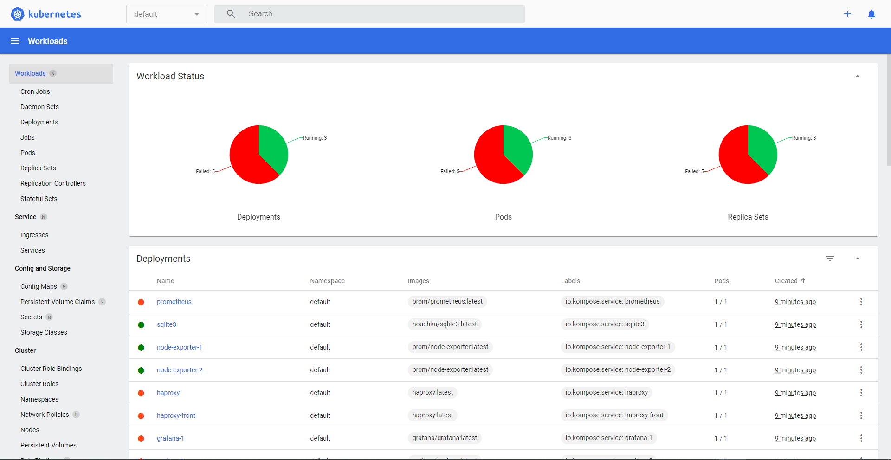

# Uso de minikube

Para realizar esta parte de la practica nos hemos ayudado de los servicios de la herramienta de Kubernetes [Kompose](https://kompose.io/). Gracias a este herramienta hemos podido pasar la infraestructura que teniamos en contenedores de Docker a Kubernetes.

Con este servicio, conseguimos todos los scripts que necesitamos para desplegar la infraestructura. Para poder desplegarla será necesario seguir los pasos siguientes:

* Encendemos el servicio de minikube: `minikube start`
* Ejecutamos el siguiente comando: `minikube dashboard` para que nos lance en el navegador una web con la información sobre nuestros pods y despliegues.
* Finalmente ejecutamos el comando que lanzará todos los servicios necesarios: 
```
kubectl apply -f grafana-1-service.yaml,grafana-2-service.yaml,haproxy-service.yaml,haproxy-front-service.yaml,node-exporter-1-service.yaml,node-exporter-2-service.yaml,prometheus-service.yaml,grafana-1-deployment.yaml,grafana-1-claim0-persistentvolumeclaim.yaml,grafana-1-claim1-persistentvolumeclaim.yaml,grafana-1-claim2-persistentvolumeclaim.yaml,backend-networkpolicy.yaml,frontend-networkpolicy.yaml,grafana-2-deployment.yaml,grafana-2-claim0-persistentvolumeclaim.yaml,grafana-2-claim1-persistentvolumeclaim.yaml,haproxy-deployment.yaml,grafana-2-claim2-persistentvolumeclaim.yaml,haproxy-front-deployment.yaml,haproxy-front-claim0-persistentvolumeclaim.yaml,node-exporter-1-deployment.yaml,node-exporter-2-deployment.yaml,prometheus-deployment.yaml,prometheus-claim0-persistentvolumeclaim.yaml,prometheus-data-persistentvolumeclaim.yaml,sqlite3-deployment.yaml,sqlite3-claim0-persistentvolumeclaim.yaml,haproxy-claim0-persistentvolumeclaim.yaml
```
Una vez realizado esto podemos ver en el navegador que ha ocurrido con nuestros pods. Y como podemos ver en la imagen inferior existen varios errores que impiden que se despliegue de manera correcta el servicio de Grafana.


