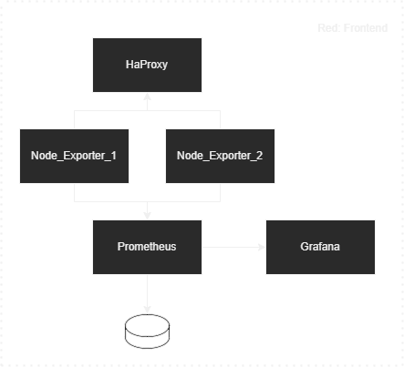

# Uso del script *infra.sh*

## Opciones

#### > ./infra.sh
En caso de ejecutar el script sin ningun parametro de entrada nos encontraremos con que nos devuelve un mensaje que nos indica que para saber como usar la herramienta debemos ejecutarla junto al comando help

```
→ ./infra.sh
Usa la opcion help para saber mas
```

#### > ./infra.sh help
Nos devolverá un pequeño resumen de como debe usarse este servicio

```
→ ./infra.sh help
Las directivas que puedes usar son:
           - up | UP | Up : levantar la infraestructura
           - down | DOWN | Down : apagar la infraestructura
```

#### > ./infra.sh up
Levantará toda la infraestructura pedida mientras muestra por pantalla el paso a paso de lo que va realizando.

```
Levantando infraestructura...
Creacion de los volumenes:
Creacion del volumen prometheus_data

Creacion de las redes:
backend: 7547bc446e486d0f806db76883c721ea2fb054b01fd62ce948414b5bef6b4361

Creacion de los servicios:
prometheus: f2719ce1eb6b24473d15f2da87d78b644e4f3d5ef490834955e1f15bebc60c4d
haproxy: a74e33a67d09740cff8cac877f70b4d2462d6543630dbe866366c319804d62bb
node-exporter_1: d91337b8b5252b6268ea6ffb0da4b1f85816167f33497bee7282ca1434e9c734
node-exporter_2: afe976e99436c396719c1d5911990b556d0afa93989974f0f374965f7cdfad8f
grafana: 1c148e2372598fd8012665a708f45d4723bc37770a1756904f6d9fc0c3336f5b
```

En caso de que ya esté creada y volvamos a ejecutarla, nos irá devolviendo errores en cada uno de los servicios indicando que ya existe uno con esas caracteristicas.

#### > ./infra.sh down
Destruye la infraestructura creada anteriormente.

```
Apagando infraestructura...

Apagado de los servicios:
Parando prometheus
Eliminando prometheus
Parando haproxy
Eliminando haproxy
Parando node-exporter_1
Eliminando node-exporter_1
Parando node-exporter_2
Eliminando node-exporter_2
Parando grafana
Eliminando grafana

Eliminacion de los volumenes:
prometheus_data

Eliminacion de las redes:
backend
```

En caso de que ejecutemos la opcion de destruir la infraestructura sin que esté levantada nos irá dando errores en cada uno de los pasos al no encontrar que eliminar y destruir.

## Infraestructura




