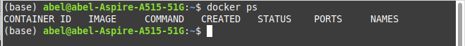
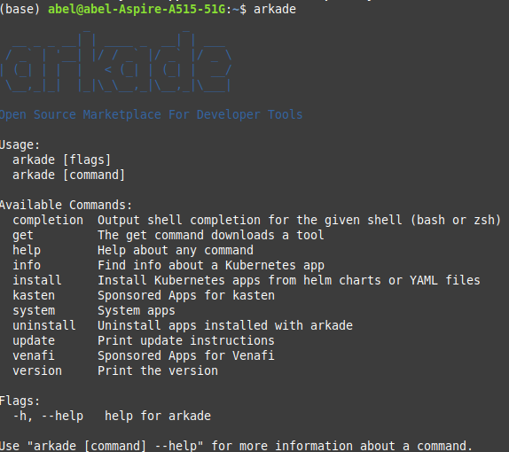

# Cloud Computing: Servicios y aplicaciones. Entrega Práctica 2

Para esta práctica se ha desarrollado una función serverless, haciendo uso de la plataforma OpenFaaS, que constituye un endpoint al cual llamar para detectar caras en una imagen. En el cuerpo de la petición se envía un url, en texto plano, y finalmente el endpoint devuelve la imagen con las caras remarcadas, la imagen se descarga en el navegador. Esta documentación asume que se dispone de Docker y una cuenta en DockerHub.

## Instalación del entorno OpenFaaS

El entorno de OpenFaaS se ha instalado de forma local, en este documento se tratará la instalación desde 0, pero donde Docker se considera instalado, aunque no haya ninguna imagen en él. Para estar seguro que se parte de 0 se van a eliminar todos los contenedores e imagenes. 

Para los contenedores:

``` shell
docker rm -vf $(docker ps -aq)
```

Para las imágenes:

``` shell
docker rmi -f $(docker images -aq)
```



### Instalación minikube

Instalar minikube es sencillo, en su [web](https://minikube.sigs.k8s.io/docs/start/) ofrecen cómo instalar la ultima release en linux. Después de la instalación basta ejecutar el comando **minikube start**.

``` shell
curl -LO https://storage.googleapis.com/minikube/releases/latest/minikube-linux-amd64
sudo install minikube-linux-amd64 /usr/local/bin/minikube
```

### Instalación de herramientas de entorno con Arkade

Arkade es una herramienta que ayuda enormemente a la instalación de entornos sobre kubernetes.
En la web de [arkade](https://github.com/alexellis/arkade) se puede ver su instalación, en mi caso se ha empleado la opción con cUrl:

``` shell
curl -sLS https://get.arkade.dev | sudo sh
```



Para instalar herramientas como kubectl, basta:

``` shell
arkade get kubectl
```

Ejecutamos órdenes análogas para instalar __faas_cli__ y __kind__. Esta última es una herramienta que ayuda al desarrollo local de Kubernetes y al CI. Se va a crear un cluster y un registro básicos tomando un script de la propia herramienta [aquí](https://kind.sigs.k8s.io/docs/user/local-registry/). Este script se va a colocar dentro de una carpeta que se ha creado con nombre **openfaas**, por ejemplo. Le damos permisos de ejecución al script y lo ejecutamos. Es importante que las variables __PATH__ estén correctamente configuradas para que el script encuentre la orden **kind**. Con exportarla de la forma que arkade recomienda al instalarla sería suficiente.

Es importante también habilitar el puerto 5000 para el script como conexión no segura. En docker Windows y MacOS, es posible hacerlo desde la propia UI de Docker, en linux, es necesario editar el fichero '/etc/docker/daemon.json' y añadir la siguiente linea. Docker lo explica en su [página](https://docs.docker.com/registry/insecure/) si se necesita más información.


```json
{
  "insecure-registries" : ["myregistrydomain.com:5000"]
}
```

El resultado tras ejecutar el script es


Ahora se pude ejecutar el comando **kubectl config current-context** y debería aparecer el contexto __kind__. Si vemos los nodos con **kubectl get nodes**.


También conviene ver que los nuevos pods se encuentra activos **kubectl get pods -n kube-system**, como se ve en la imagen, también es posible ver los logs de docker con **docker logs -f kind-registry**.


### Instalación OpenFaaS

Para la instalación de OpenFaaS se ha utilizado también Arkade, basta ejecutar **arkade install openfaas**. Arkade sirve como una herramienta de gran ayuda, pues la información y consejos emitidos en consola tras su instalación es sumamente útil para terminar la configuración de OpenFaaS. Aparecen como consejos cómo exponer el puerto para poder acceder en locahost a OpenFaaS y cómo realizar el log-in con un comando para logearse en OpenFaaS.


Se ejecutan los comandos para exportar el puerto del servicio OpenFaaS y para el log-in (mas abajo). Exportar el puerto:

``` shell
kubectl port-forward -n openfaas svc/gateway 8080:8080
```

También, una vez expuesto el puerto, es posible tomar directamente la contraseña con **PASSWORD=$(kubectl get secret -n openfaas basic-auth -o jsonpath="{.data.basic-auth-password}" | base64 --decode ; echo)** e ir a **localhost:8080** para realizar el log-in "a mano", donde el usuario es 'admin' y la constraseña esta guardada en la variable $PASSWORD. Si vamos a **localhost:8080** ya tenemos la vista de entrada de OpenFaaS.


## Implementación de la función de detección de caras

Para implementar la función de detección de caras y posteriormente desplegar la misma, se ha decidido optar por un template de función de OpenFaaS, esta decisión se ha tomado por las comodidades y el entorno que la herramienta despliega, donde se ofrece un template de Dockefile, entorno de test y comodidades específicas en python como un archivo 'requirements.txt' ya creado para las dependencias en python donde solo se deben escribir los paquetes y el dockerfile los tomará automáticamente.

Anteriormente se ha instalado **faas-cli** por lo que ahora es posible ver una lista de los templates disponibles con el comando **faas-cli template store list**. Apareceran templates disponibles para multitud de lenguajes y entornos diferentes, en este caso se ha seleccionado el template __python3-flask-debian__. Vamos a descargar los templates y posteriormente crear la nueva función **facedetection**.

Para descargar los templates 

```shell
faas-cli template store pull python3-flask
```

Para crear una nueva función ejecutamos el comando

```shell
faas-cli new facedetection --lang python3-flask-debian
```

Si se ha instalado bien aparecera la imagen 


Se habrá creado toda una estructura de carpetas dentro de una carpeta con el nombre de la función, en nuestro caso **facedetection**. Como se ha comentado antes, será necesario complementar el fichero requierements.txt y dentro del archivo **handler.py** añadir toda la lógica de nuestra función. Es importante también que en la misma carpeta se encuentre nuestro fichero **haarcascade_frontalface_default.xml**, pues tiene el modelo preentrenado de detección de caras. El codigo completo de **handler.py** es

```python

import cv2
import requests
import numpy as np
from flask import Flask, request, Response, send_file
from tempfile import NamedTemporaryFile
from urllib.request import urlopen

def url_to_image(url, readFlag=cv2.IMREAD_COLOR):
    resp = urlopen(url)
    image = np.asarray(bytearray(resp.read()), dtype="uint8")
    image = cv2.imdecode(image, readFlag)

    return image

def draw_faces(img):
    gray = cv2.cvtColor(img, cv2.COLOR_BGR2GRAY)
    # Detectar caras
    face_cascade = cv2.CascadeClassifier(cv2.data.haarcascades + 'haarcascade_frontalface_default.xml')

    faces = face_cascade.detectMultiScale(
        gray
    )
    # Elipse alrededor de las caras
    for (x, y, w, h) in faces:
        center = (x + w//2, y + h//2)
        img = cv2.ellipse(img, center, (w//2, h//2), 0, 0, 360, (255, 0, 255), 4)

    return img

def handle(req):
    """handle a request to the function
    Args:
        req (str): request body
    """
    image = url_to_image(req)
    img = draw_faces(image)
    with NamedTemporaryFile() as tmp:
        iName = "".join([str(tmp.name),".jpg"])
        cv2.imwrite(iName,image)
        return send_file(iName, mimetype='image/jpg')
```

La función que se ejecutará cuando se realice la llamada en openfaas será **handle**, esta llamará **url_to_image** para descargar la imagen de la url que se envía en el cuerpo de la llamada. Posteriormente en **draw_faces** se ejecuta el modelo y se dibuja una elipse entorno a cada cara y se devuelve la imagen con las caras remarcadas, que se envía al usuario y se descarga en el navegador. En cuanto al fichero **requirements.txt** que tomará las librerías necesarias para la función y es el archivo que leerá el dichero **DockerFile** del template.

Su contenido será:

```txt
numpy==1.19.0
opencv-python-headless
Pillow==9.1.1
requests==2.27.1
urllib3==1.26.9
```

También se puede observar que se ha creado un archivo **facedetection.yml**, la configuración del template de este archivo esta casi lista para el despliegue, sin embargo, hay que configurar la sección **image** del mismo. Cuando se quiera desplegar la función, la imagen que se ha creado a partir del template se subirá a Dockerhub como paso necesario para el despliegue, por lo que es importante haber configurado la sección imagen para contenga nuestro usuario de DockerHub, en mi caso sería **abeljosesanchez/facedetection:latest**. Este es el lugar donde la imagen se subirá, por supuesto es importante también que se haya hecho log in desde la consola que se ejecuta el despliegue de la función.

### Despliegue de la función

Ya se tiene todo lo necesario para el despliegue. La herramienta de cli de faas ofrece comandos para cada paso, estos son; **build**, **push** y **deploy**. Opcionalmente se puede utilizar la opción **up** para realizar las 3 acciones en un solo comando. **Build** tomará el fichero Dockerfile del template y creará una imagen, **push** la subirá a DockerHub y **deploy** la desplegará en OpenFaaS.

Ejecutando el comando:
```shell
faas-cli build -f facedetection.yml
```
Se crea la imagen, es posible listar las imágenes con **docker images**.


Se sube la imagen


Para el despliegue es necesario estar logeado, por lo que se debe ejecutar los comandos que se han comentado en el momento de instalación de OpenFaaS.

Comando opcional para el login si se crea la variable contraseña como se ha indicado en este documento:
```shell
echo -n $PASSWORD | faas-cli login --username admin --password-stdin
```

Ahora si se ejecuta **faas-cli deploy -f facedetection.yml**


Si se accede a **localhost:8080** vemos que la función esta desplegada y es posible invocarla:


Se va a llamar a la función desde la UI de OpenFaaS que se presenta en **localhost:8080**, para ello en la caja correspondiente al cuerpo de la función se introduce el enlace a la imagen en la que se quieran detectar las caras, en mi caso he tomado un link de una imagen de prueba de google imágenes con licencia Creative Commons, se puede encontrar [aquí](https://st4.depositphotos.com/13193658/22972/i/1600/depositphotos_229723264-stock-photo-smiling-couple-holding-coffee-cups.jpg). Además, se marca la opción de descargar la respuesta de la función. La función devuelve la imagen con las caras remarcadas por un círculo.

El resultado de la llamada a la función se muestra en la siguiente imagen.


Y la imagen devuelta


## Conclusiones

OpenFaaS es una herramienta poderosa para la realización de funciones serverless y un rápido despliegue, la configuración inicial puede ser un poco confusa y demasiado extensa, pero herramientas como Arkade ayudan a esta tarea. En lo general es una herramienta rápida y flexible para crear aplicaciones ligeras y que se actualicen habitualmente, así como para trasladar una posible parte de la carga de las aplicaciones cerca del usuario o a servidores mas potentes que realicen el cálculo de forma rápida y posibilitan a servidores de empresas menos potentes dar una respuesta como si tuvieran gran potencia de cálculo.

En esta guía se ha pretendido exponer la instalación desde 0 de esta herramienta y un ejemplo de utilización útil como la detección de caras en una imagen y se desea que sea de agrado al lector.
